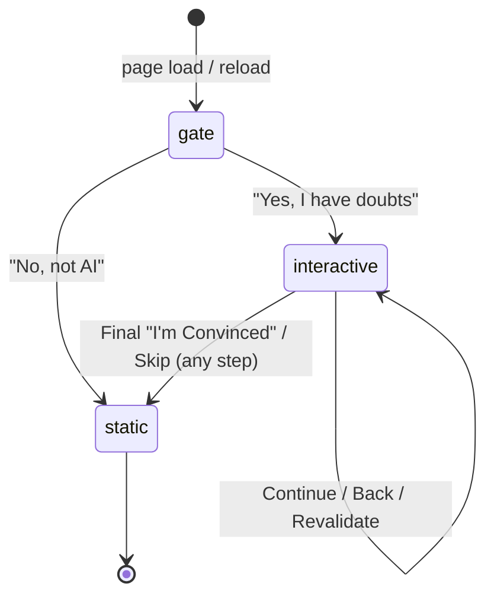
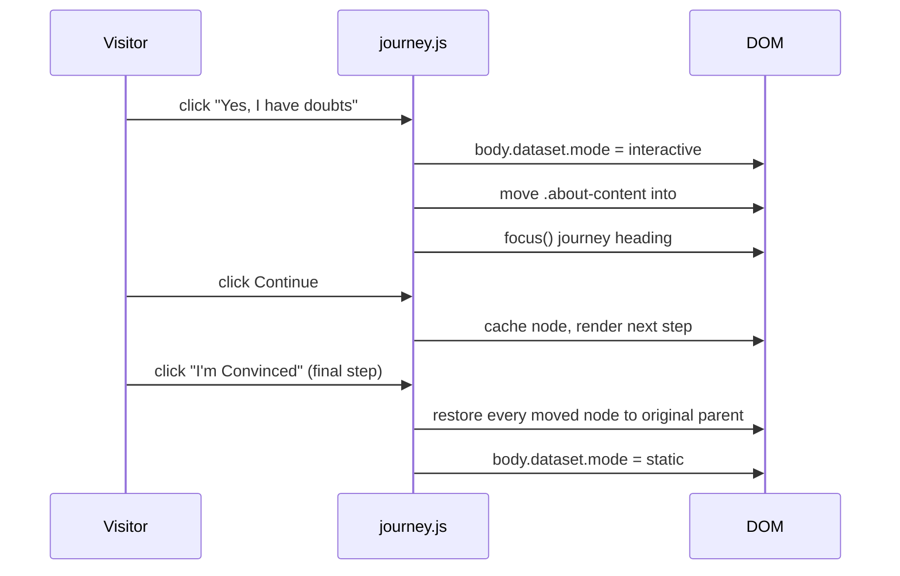

# Portfolio Design v2

Plain HTML/CSS/JS, no build step, no framework. Three files: `index.html`, `style.css`, `script.js`.

## Core Idea

One DOM, one source of truth for content, two experiences layered on top via a small state machine. No content duplication, the interactive journey borrows the real static-portfolio nodes and gives them back.

## State Machine

`body[data-mode]` drives everything through CSS. Every reload starts at `gate`, nothing is persisted to storage.



## DOM Shape

```
<body data-mode="...">
  #authenticity-gate      (gate question, 2 buttons)
  #journey                (single reusable step shell)
  <template> x3           (thinking / leetcode / final; journey-only content)
  #site-content           (nav + all real sections + footer, untouched)
</body>
```

CSS shows/hides by mode:

- `gate` → only `#authenticity-gate`
- `interactive` → only `#journey`
- `static` → only `#site-content`

`<noscript>` forces `#site-content` visible if JS fails meaning visitor is never trapped.

## Journey Mechanics

`steps[]` is an ordered array of `{ id, eyebrow, heading, context, source }`. `source.type` is either:

- `move` real section content (`.about-content`, `.projects-grid`, …) is **re-parented** into `#journey-body`, not cloned.
- `template` journey-only content (How I Think, LeetCode, Final) cloned from `<template>`.



Key mechanism: `moveNodeToJourney()` moves a node once and **caches it by step id**. `restoreMovedNodes()` walks the cache and puts every node back where it came from (`parent` + `nextSibling`) on exit. This makes Back / Revalidate / Skip all safe meaning nothing is ever lost or duplicated.

## Journey Controls (per step)

| Button | Behavior |
|---|---|
| Continue → | advance one step; on final step, exits to static |
| One sec, let me go back ← | step back one (hidden on step 1) |
| No, I want to revalidate again | jump back to step 1 (final step only) |
| Skip ahead / View full portfolio | fail-safe exit to static from any step |

## Accessibility & Resilience

- Focus moves to the new step `<h2>` on every render (screen-reader + keyboard users always know "what changed").
- `prefers-reduced-motion` collapses all transitions/animations to ~0.
- `[hidden]` is force-enforced via `.journey-actions [hidden] { display:none }` and `.btn` sets `display` explicitly, which otherwise beats the UA `[hidden]` rule.
- Gate is a `role="dialog"` with `aria-modal`; all external links use `rel="noopener noreferrer"`.

## Deliberately Not Done

- No animation library, no routing, no build tooling.
- No localStorage/sessionStorage for journey state so reload always resets to the gate, by design.
- No content duplicated between static and interactive modes so same nodes, different parent.
